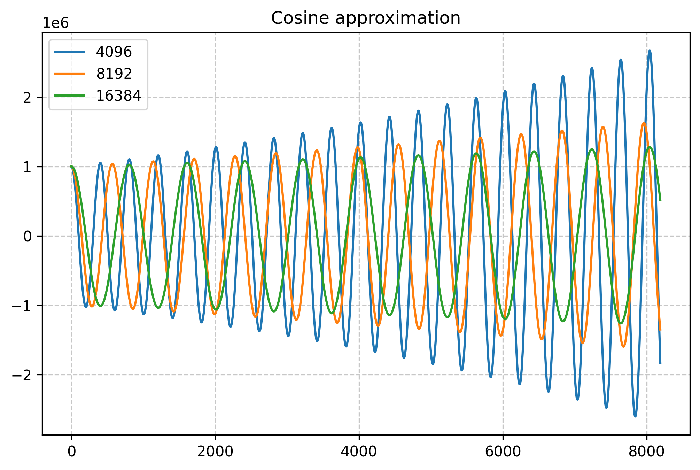
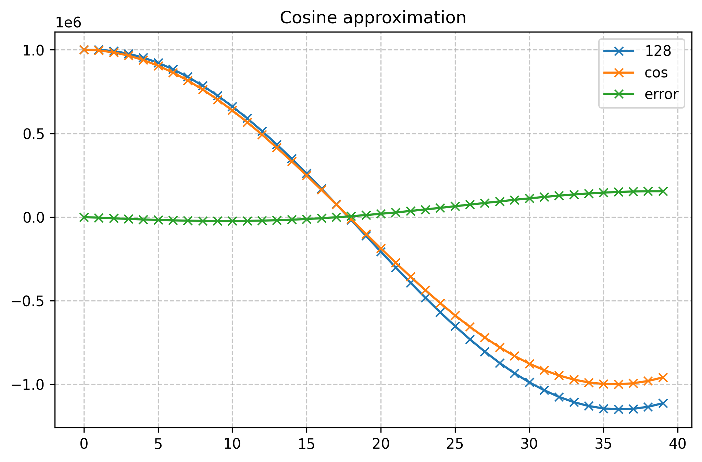

# Cosine Approximation

[cnohr](https://bsky.app/profile/cnlohr.bsky.social) posted this interesting
cosine and sine approximation function on [Bluesky](https://bsky.app/profile/cnlohr.bsky.social/post/3lg5e3c7ifc26).

The original code has a `>>13` or divide by 8192 term that determines the number of
points in one period.

I reimplemented the function in Python to have a closer look at the behavior.

Here's what happens when you use different dividers:

Over time, the amplitude of the function increases. But how does it compare to a real
cosine function? Here's a comparison between a real cosine and the function with
a 16384 division factor:

I manually tuned the period of the real cosine to get a close match of the
period of the two functions. Let's look at the same graph but only plot
the first 1000 numbers:

Not bad, especially in the first quadrant, before the approximation first
crosses through zero. The maximum error is 0.35% relative to the amplitude.
(The maximum relative error per point is 42%, but that's when the function 
is close to zero.)

Here's what happens for a very low divider of 128. I only show the first 2
quadrants, after that the approximation already starts to diverge way too much...

