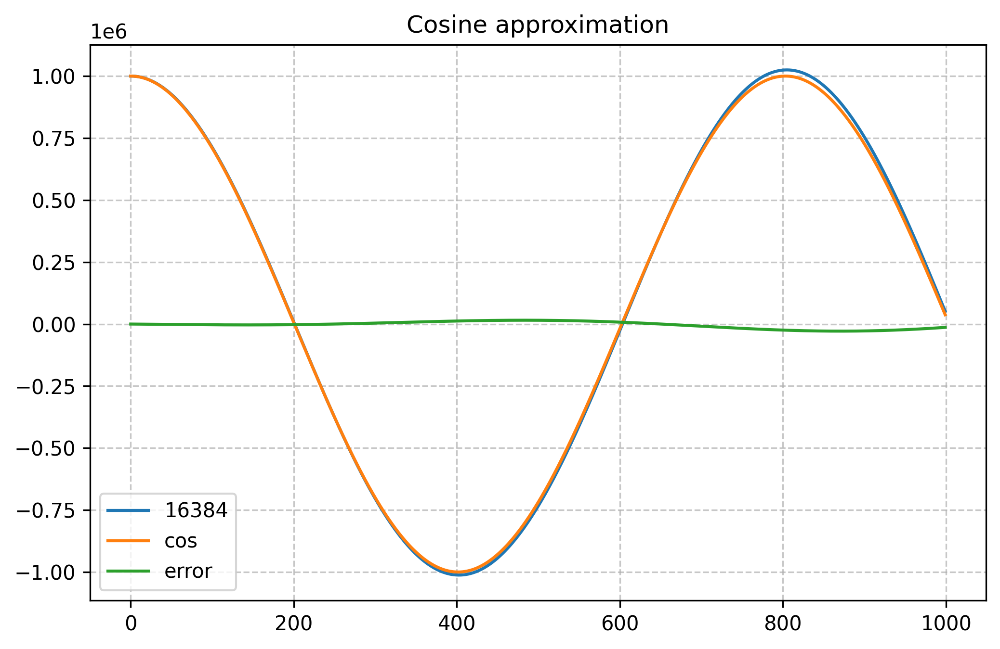

# Cosine Approximation

[cnohr](https://bsky.app/profile/cnlohr.bsky.social) posted this interesting
cosine and sine approximation function on [Bluesky](https://bsky.app/profile/cnlohr.bsky.social/post/3lg5e3c7ifc26).


The original code has a `>>13` or divide by 8192 term that determines the number of
points in one period.

I reimplemented the function in Python to have a closer look at the behavior.

Here's what happens when you use different dividers:


Over time, the amplitude of the function increases. But how does it compare to a real
cosine function? Here's a comparison between a real cosine and the function with
a 16384 division factor:


I manually tuned the period of the real cosine to get a close match of the
period of the two functions. Let's look at the same graph but only plot
the first 1000 numbers:



Not bad, especially in the first quadrant, before the approximation first
crosses through zero. The maximum error is 0.35% relative to the amplitude.
(The maximum relative error per point is 42%, but that's when the function 
is close to zero.)

Here's what happens for a very low divider of 128. I only show the first 2
quadrants, after that the approximation already starts to diverge way too much...


Lower dividers result in higher errors. In this case, the error relative to the
maximum amplitude is 2.3% over the first 17 points, the first quadrant.

If we only care about the first quadrant, we still need to know how many points
there are in the first quadrant for a given divider.


 | Right shift | Divider | Nr Points | Nr Points/sqrt(Divider) |
 |-------|-----|-----------|---------------------|
 | 4 | 16 | 6 | 0.6667 |
 | 5 | 32 | 8 | 0.7071 |
 | 6 | 64 | 12 | 0.6667 |
 | 7 | 128 | 17 | 0.6655 |
 | 8 | 256 | 25 | 0.64 |
 | 9 | 512 | 35 | 0.6465 |
 | 10 | 1024 | 50 | 0.64 |
 | 11 | 2048 | 71 | 0.6374 |
 | 12 | 4096 | 100 | 0.64 |
 | 13 | 8192 | 142 | 0.6374 |
 | 14 | 16384 | 201 | 0.6368 |
 | 15 | 32768 | 284 | 0.6374 |
 | 16 | 65536 | 402 | 0.6368 |
 | 17 | 131072 | 568 | 0.6374 |
 | 18 | 262144 | 804 | 0.6368 |
 | 19 | 524288 | 1137 | 0.6368 |
 | 20 | 1048576 | 1609 | 0.6364 |
 | 21 | 2097152 | 2275 | 0.6366 |
 | 22 | 4194304 | 3219 | 0.6362 |
 | 23 | 8388608 | 4553 | 0.6361 |

For here, we can estimate the number of points per quadrant as follows:

```
nr_points ~ sqrt(divider) / 0.64
```

When the divider is an even power of two, this becomes:

```
nr_points ~ 2**(shift-1) / 0.64
```


